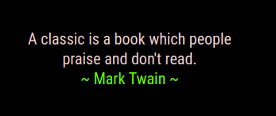

## MMM-Confucius

### Nothing special here but future upgrades are being considered

A rotation of Confucius quotes and other authors. e.g. Mark Twain etc

## Examples

* Default white. Fonts color can easily be changed in custom.css file



## Installation and requirements

* `git clone https://github.com/mykle1/MMM-Confucius` into the `~/MagicMirror/modules` directory.

* Free API key at `https://www.quotes.net/quotes_api.php` (Required)

* No dependencies needed! No kidding!

## Config.js entry and options

```
{
  disabled: false,
module: 'MMM-Confucius',
position: 'top right', // Any region. Adjust maxWidth below
config: {
    uid: "Your uid", // Free at quotes.net.
    tokenid: "Your tokenid", // Free at quotes.net.
    category: "quotes",
    searchtype: "author", // search, author or random
    query: "Mark Twain", // Author name in case of AUTHOR request, or any query in case of SEARCH request
    useHeader: false, // true if you want a header
    header: "Your Header", // Any text you want. useHeader must be true
    maxWidth: "300px", // constrain to your liking
    rotateInterval: 5 * 60 * 1000,
  }
},
```
